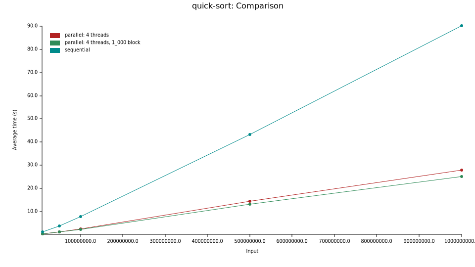

# Advanced Parallel Algorithms

## results

### quick sort

|                 | `Sequential`              | `Parallel: 4 threads`            | `Parallel: 4 threads, 1_000 block` |
| :-------------- | :------------------------ | :------------------------------- | :--------------------------------- |
| **`10000000`**  | `703.31 ms` (✅ **1.00x**) | `235.82 ms` (🚀 **2.98x faster**) | `211.91 ms` (🚀 **3.32x faster**)   |
| **`50000000`**  | `3.97 s` (✅ **1.00x**)    | `1.24 s` (🚀 **3.21x faster**)    | `1.15 s` (🚀 **3.46x faster**)      |
| **`100000000`** | `8.01 s` (✅ **1.00x**)    | `2.45 s` (🚀 **3.26x faster**)    | `2.25 s` (🚀 **3.56x faster**)      |

### bfs

### how to use

#### run benchmarks and generate plots

- install `Cargo`
- `cargo bench`

#### run benchmarks and generate markdown table

- `cargo install criterion`
- `cargo install criterion-table`
- `cargo criterion --message-format=json | criterion-table > BENCHMARKS.md`
